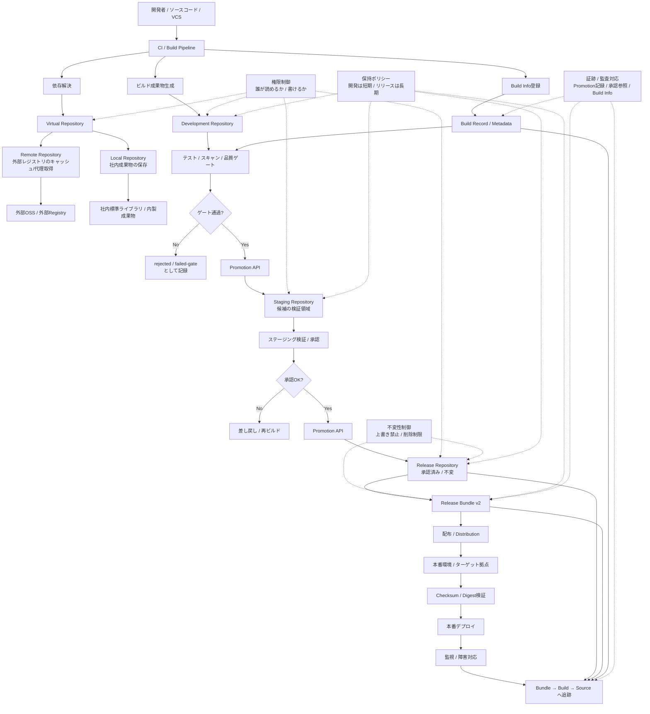

# Artifactory 全体像

- **Artifactory は単なる保存庫ではなく、成果物のライフサイクルを制御する中核**
- Artifactory を「ただの置き場」ではなく**品質保証の制御点**にしている

## 1. 入口：依存解決と成果物保存

- CI は Artifactory の Virtual Repository を入口として依存解決する
- 外部OSSは Remote Repository でキャッシュし、社内成果物は Local Repository に置く
- これにより、依存解決の入口が統制される

## 2. ビルド：成果物と Build Info を残す

- ビルド成果物だけでなく、Build Info も登録する
- 何から作られたか、どの依存を使ったかを後から追える

## 3. 判定：テスト・スキャン・承認

- Development Repository に置かれた成果物を、そのままゲートにかける
- 合格したものだけを Promotion する
- ここで重要なのは、再ビルドせず、同じバイト列を昇格すること

## 4. 境界：Development → Staging → Release

- Development は頻繁更新を許容
- Staging は候補の検証
- Release は承認済みで不変
- この境界そのものが統制点になる

## 5. 配布：Release Bundle と Distribution

- Release Repository 上の承認済み成果物を、必要に応じて Release Bundle v2 として束ねる
- それをターゲット環境へ配布する
- 本番は広い入口を見ず、承認済みの供給源だけを見る

## 6. 検証：Checksum / Digest / 追跡

- 配布後に整合性を確認する
- 障害時には Bundle → Build → Source と逆追跡できる
- これが監査や障害対応で効く

## 7. 下支え：権限・不変性・保持

- 誰が書けるか
- 上書きできるか
- どれだけ保持するか