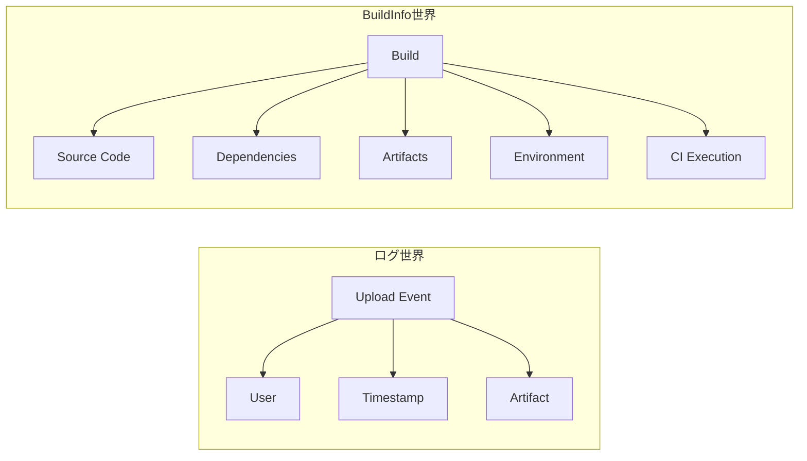

# BuildInfoについて

## BuildInfoとは

BuildInfoは**「ビルドのスナップショット**

## BuildInfoの役割

**プロモーションの制御点**

- 再現性を保証する
- プロモーションを制御する
- 依存のブレを防ぐ

## 含まれる情報（典型）

**「このビルドは、どのコード・どの依存・どの環境で作られたか」**

- build name / build number
- 実行したCI（Jenkins / GitHub Actionsなど）
- 実行ユーザ
- 環境変数
- 使用した依存関係（dependencies）
- 生成された成果物（artifacts）
- VCS情報（Git commit, branch）
- モジュール構成

## BuildInfoがない時とある時

- BuildInfoがない場合

  - artifact単体でしか見えない
  - 「本当にテスト済みのものか？」が分からない
  - 再ビルドが混入するリスク

- BuildInfoがある場合

  - 「このビルドで作られた成果物だけ」を昇格できる
  - 依存関係ごと固定できる
  - SBOM的な役割も担う

- ログではこうなる

 - artifact A がある → いつ誰が上げたかは分かる
 - でも →
   - どのビルド？
   - 同じ構成を再現できる？
   - 依存は同じ？

👉 全部分からない

## 単なるログとの違い

| 用途 | 使うもの |
|-----|------|
| 不正操作の調査 | ログ |
| インシデント再現 | BuildInfo |
| リリース判定 | BuildInfo |
| SBOM / セキュリティ | BuildInfo |
| 誰がアップロードしたか確認 | ログ |

