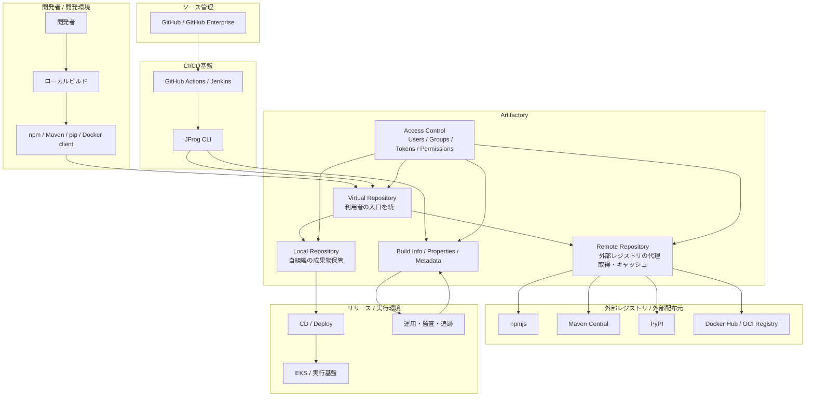

# 全体像



##【補足】この図の読み方

この図の本質は、Artifactory を単なる保管庫ではなく、
**「依存関係と成果物の制御点」**として置いていること。

### Virtual Repository が入口

利用者やCIは、できるだけ個別Repoを直接見ない。
Virtual Repository を共通入口にすることで、

	•	利用先URLを統一できる
	•	backendの差し替えがしやすい
	•	local / remote の違いを利用者に隠せる
	•	誤接続や設定ばらつきを減らせる

つまり、運用上の抽象化レイヤ。

### Local / Remote / Virtual で責務が分かれる

**Artifactoryの本質**

	•	Local

```
自社成果物を保存する場所
例: 自社のnpm package, Maven artifact, Docker image
```

	•	Remote

```
外部レジストリの代理取得 + キャッシュ
例: npmjs, Maven Central, Docker Hub
```

	•	Virtual

```
利用者向けの統合窓口
例: build側は1つのURLだけ覚えればよい
```

これはストレージ分類ではなく、
責務分離と事故防止の設計

### Build Info / Metadata が証跡になる

Artifactoryは「ファイル置き場」だけでは**追跡可能性**が弱い、
Build Info を使うと追跡可能性が一気に上がる。

たとえば：

	•	どのCIジョブが
	•	どのcommitから
	•	どの依存関係を使い
	•	どの成果物を作り
	•	どこへpromoteしたか

が見えるようになる

### セキュリティは後付けではなく横断設計

認証・認可・トークンはArtifactoryの周辺機能ではなく、
**成果物ライフサイクルを制御する主軸**

例：

	•	開発者は read のみ
	•	CI は特定repoへの deploy のみ
	•	promote は release管理ロールのみ
	•	prod repo は overwrite禁止

こうすると、事故が起きにくい構造になる

## CI基盤における位置づけ

**「依存解決・成果物保管・証跡管理・配布制御を一元化する中核」**

CI基盤で見ると、GitHub や Jenkins が「処理を走らせる場所」だとすると、
**Artifactory は “何を使って、何を作って、何を出したか” を制御する場所 **

	•	依存取得元の統制
	•	成果物の格納
	•	署名/整合性/メタデータ管理
	•	Promote / 配布境界
	•	build info による追跡

### 【言い換え】Artifactoryの意味

	•	依存の入口を統一
	•	キャッシュにより安定性向上
	•	build info により追跡性向上
	•	promotion によりリリース境界を明確化
	•	権限設計により事故を減らす


### 【補足】その他のCI関連物

####cGitHub / GitHub Enterprise

	•	ソースコード管理
	•	Pull Request
	•	変更履歴
	•	ワークフロー定義

#### GitHub Actions / Jenkins

	•	ビルド実行
	•	テスト実行
	•	パイプライン制御

