# リリース管理

## 実務向けの統合版（1枚で見たい場合）

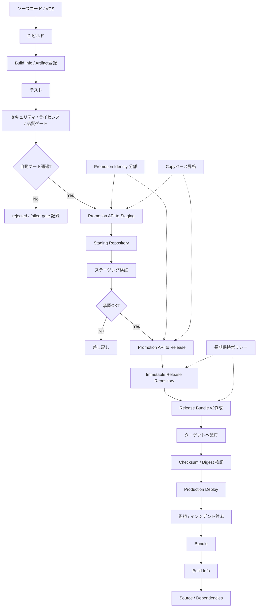

## 全体像

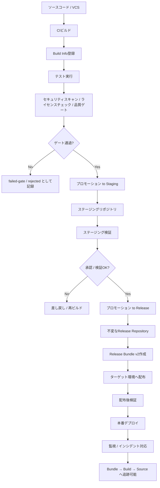

## 「Promotionはビルド工程ではなくライフサイクル遷移」であることの構造図

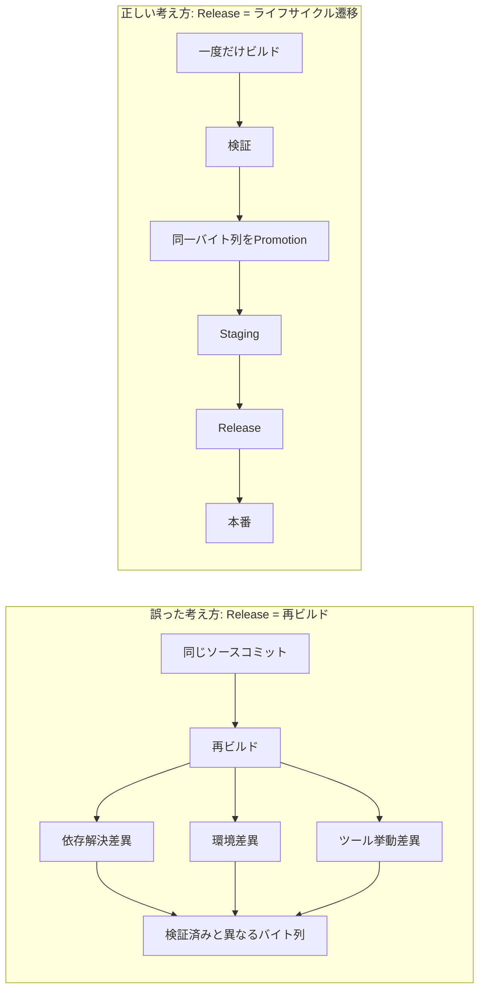

## リポジトリ境界とライフサイクル

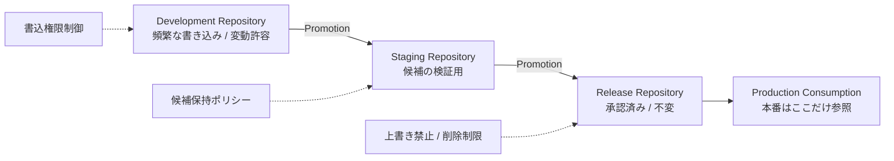

## Copy と Move の判断図

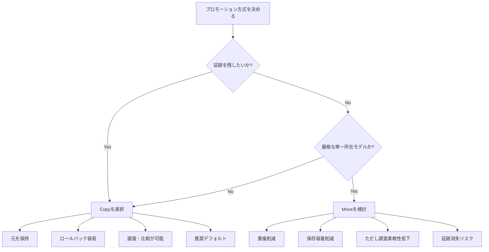

## 自動ゲートと REST API プロモーション

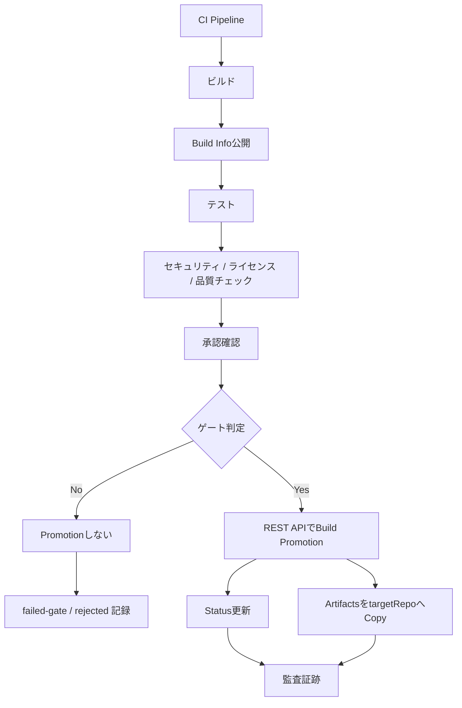

## 権限分離の構造図

```
flowchart LR
    A[Build Identity<br/>通常CI権限]
    B[Promotion Identity<br/>昇格専用権限]
    C[Development Repo]
    D[Staging Repo]
    E[Release Repo]

    A -->|publish| C
    B -->|copy + status update| D
    B -->|copy + status update| E

    X[最小権限] -.-> A
    Y[Build Info参照 + targetRepo書込のみ] -.-> B
    Z[管理者トークン禁止] -.-> B
```

## Release Bundle v2 の概念図

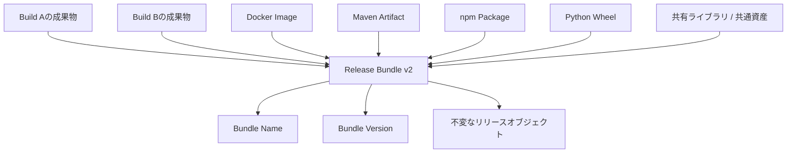

## Release Bundle の配布と検証

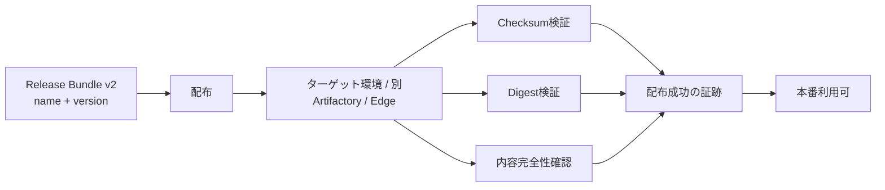

## 証跡チェーン（監査・インシデント対応）

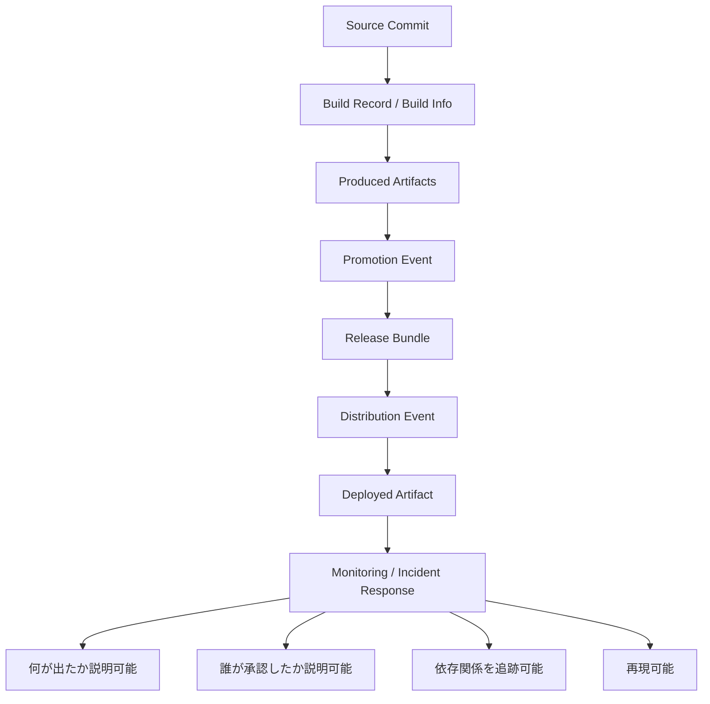

## 本番への流入制御

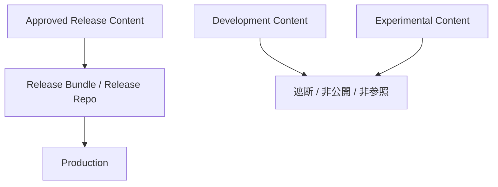

## 保持ポリシーと証跡保全

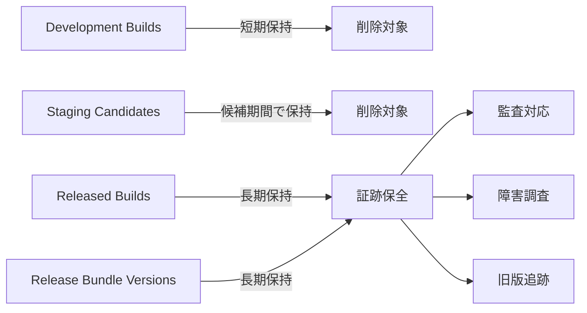

