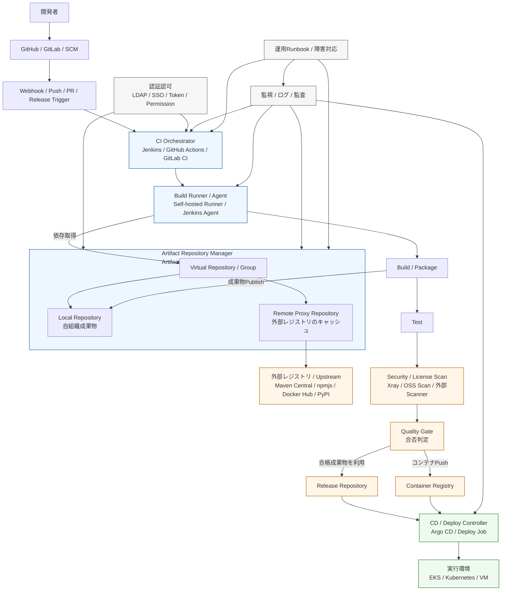

# CI基盤における位置づけ

## 入力の制御点

Runner はビルド時に外部の依存を直接取りに行くのではなく、
原則として Artifactory / Nexus 経由で取得する。

つまり、

- npmjs
- Maven Central
- Docker Hub
- PyPI

へのアクセスを、直接ではなく
Remote Proxy Repository を通して統制する位置です。

これにより、

- キャッシュ
- 外部通信先の限定
- 取得物の再現性確保
- 障害時の切り分け簡易化

が可能。