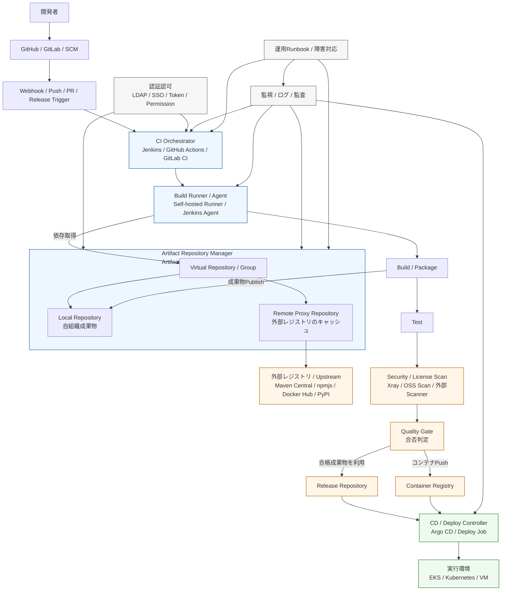

# CI基盤における位置づけ

```
SCM = ソースの正本
CI = ビルドと検証の実行主体
Artifact Repository = 依存取得と成果物供給の制御点
CD = 確定済み成果物の配備主体
Runtime = 実行場所
```



## 入力の制御点

Runner はビルド時に外部の依存を直接取りに行くのではなく、
原則として Artifactory / Nexus 経由で取得する。

つまり、

- npmjs
- Maven Central
- Docker Hub
- PyPI

へのアクセスを、直接ではなく
Remote Proxy Repository を通して統制する位置です。

これにより、

- キャッシュ
- 外部通信先の限定
- 取得物の再現性確保
- 障害時の切り分け簡易化

が可能。

## 出力の制御点

Build で作られた成果物は、
まず Artifact Repository に格納されるのが基本。

ここで重要なのは、成果物が

- 誰が
- どのソースから
- どのビルドで
- どの依存を使って
- いつ作ったか

という文脈と結びつくこと。

CI基盤として見ると、Artifactory / Nexus は
**“ビルド結果の保存場所”ではなく、“正式成果物の境界”**です。

## デプロイの供給源

CD やデプロイ処理は、
Git のソースそのものではなく、確定済みの成果物を参照するのが安定です。

つまり実運用では、

- SCM は「ソースの正本」
- Artifact Repository は「配布物の正本」

として役割分離されます。

この分離が曖昧だと、

- 再ビルドで差が出る
- 本番に何を入れたか追えない
- rollback が不安定
- 検証済み成果物の定義が崩れる

という事故が起きやすくなります。

## CI基盤として見たときの本質

**「依存取得」と「成果物供給」の両方を制御するハブ**

- 依存取得の集約点
- 成果物保管庫
- build info / promotion / lifecycle の制御点
- 配布・監査・トレーサビリティの中心

つまり、“流通・状態管理”の色が強い