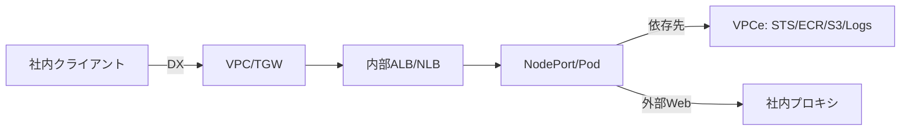

# 典型トラブル → 最短リカバリ指針
- DX経路でタイムアウト
  - On-prem↔︎VPCのルート/NACL/SGと、TGW/VGW側のアタッチ/ルートを両面確認
  - VPC Flow Logs（宛先/戻りの`actions = RELECT`を探す）
- ALB/NLB ヘルスチェックNG
  - `kubernetes -n <namespace> describe svc/ing`
    - でヘルスチェックパスとレポートを確認 → Pod側 readiness/リッスンと一致させる
- PodからAWSサービス利用が失敗
  - VPCeのPrivate DNS 有効かつSGで443許可、NO_PROXYにAWSサービスを追加
- 証明書検証エラー
  - Ingressが提示するチェーンをopensslで確認→中間CA不足/Issuer不整合をSecret/ACM側で修正
  - Node/Pod trust store に社内CA追加（イメージ差し替え or initContainerで注入）

＃経路イメージ


# 事前前提・準備
- Debian/Ubuntu
```
sudo apt-get update
sudo apt-get install -y curl ca-certificates iproute2 jq dnsutils lsof tcpdump \
  nftables net-tools procps openssl inetutils-traceroute mtr-tiny \
  awscli kubectl ss traceroute
export HTTP_PROXY=http://proxy.local:8080
export HTTPS_PROXY=http://proxy.local:8080
export NO_PROXY=".cluster.local,.svc,.svc.cluster.local,localhost,127.0.0.1,169.254.169.254,\
.eks.amazonaws.com,.amazonaws.com,<vpce-xxx-*.vpce.amazonaws.com>,<your.corp.domains>"
```
- RHEL/Alma/Rocky
```
sudo yum install -y curl ca-certificates iproute jq bind-utils lsof tcpdump \
  nftables net-tools procps-ng openssl traceroute mtr \
  awscli kubectl ss
export HTTP_PROXY=http://proxy.local:8080
export HTTPS_PROXY=http://proxy.local:8080
export NO_PROXY=".cluster.local,.svc,.svc.cluster.local,localhost,127.0.0.1,169.254.169.254,\
.eks.amazonaws.com,.amazonaws.com,<vpce-xxx-*.vpce.amazonaws.com>,<your.corp.domains>"
```
- 社内CAを全レイヤで信頼
  - Deb系
    - /usr/local/certificate
    - `update-ca-certificates`
  - RHEL系
    - /etc/pki/ca-trust/
    - `update-ca-trustextract`
  - コンテナ（ベースイメージにCA追加）
  - （必要なら）containerd/docker
    - /etc/docker/certs.d/<REGISTRY>/配置
  - Java系
    - バージョンにより異なる

# EKS初動トリアージ（共通コマンド）
- クラスタ・コア系
```
# kubeconfig 確立（必要時）
aws eks update-kubeconfig --region <ap-northeast-1> --name <cluster>

kubectl get nodes -o wide
kubectl get pods -n kube-system -o wide
kubectl get events -A --sort-by=.lastTimestamp | tail -n 120

# DNS: CoreDNS 設定とログ
kubectl -n kube-system get cm coredns -o yaml
kubectl -n kube-system logs deploy/coredns --tail=300

# CNI / kube-proxy
kubectl -n kube-system logs ds/aws-node --tail=200
kubectl -n kube-system logs ds/kube-proxy --tail=200

# Ingress / LB コントローラ（使っていれば）
kubectl -n kube-system get deploy aws-load-balancer-controller
kubectl -n kube-system logs deploy/aws-load-balancer-controller --tail=300
```
- サービス公開（ALB/NLB）
```
kubectl get svc,ing -A -o wide | egrep 'LoadBalancer|NodePort|ingressclass'
kubectl -n <ns> describe svc <svc>
kubectl -n <ns> describe ing <ing>
```
- よくある原因
  - SG/NACLで遮断、またはNodePort範囲不一致
  - TargetGroupヘルスチェックパス/ポート不整合
  - Ingress注釈ミス（ALB/NLB向けannotations）
  - CodeDNSの上流解決先が社内DNS/Route53Resolverとズレ

# 経路別チェック
## 外部（社内拠点）→DX→VPC→EKS（内部 ALB/NLB）
- DNS（社内 DNS/Private Hosted Zone）
```
# 社内端末から FQDN -> 内部ALB/NLBの名前/プライベートIPへ解決するか
nslookup app.corp.example.com
```
- LBの状態（ALS CLI）
```
# 既知の DNS 名から LB を特定
DNS="<lb-dns-from-k8s-status>"
LB_ARN=$(aws elbv2 describe-load-balancers \
  --query "LoadBalancers[?DNSName=='${DNS}'].LoadBalancerArn" -o text)

aws elbv2 describe-target-groups --load-balancer-arn "$LB_ARN"
TG_ARN="<上の出力から>"
aws elbv2 describe-target-health --target-group-arn "$TG_ARN"
```
- セキュリティ協会
```
# LB / Node / Pod へ関連する SG の入出力を点検
aws ec2 describe-security-groups --group-ids <sg-ids> \
  --query 'SecurityGroups[*].{id:GroupId,ingress:IpPermissions,egress:IpPermissionsEgress}'
# ルート/NACL
aws ec2 describe-route-tables --filters Name=vpc-id,Values=<vpc-xxx> \
  --query 'RouteTables[*].{id:RouteTableId,routes:Routes}'
```
- Pod 側リスン/Readiness
```
kubectl -n <ns> get pods -o wide -l app=<your-app>
kubectl -n <ns> describe pod <pod>
kubectl -n <ns> logs <pod> --tail=200
kubectl -n <ns> exec -it <pod> -- ss -lntp
```
## Pod→社外（①社内プロキシ経由、②VPCエンドポイント直行）
- podからの実態確認（エフェメラル診断Pod）
```
# 同一NS/ネットワークで起動して試験
kubectl -n <ns> run diag --rm -it --restart=Never \
  --image=nicolaka/netshoot -- bash
# 以降は diag コンテナ内:
env | grep -i _proxy
curl -v -x http://proxy.local:8080 https://www.google.com/
# VPCエンドポイント先の疎通（Private DNS）
dig +short s3.ap-northeast-1.amazonaws.com
aws sts get-caller-identity
aws ecr get-authorization-token --region ap-northeast-1 >/dev/null
```
> ポイント
> ・Private DNS 有効なVPCエンドポイント利用時は、NO_PROXYに対象サービス（s3.<region>.amazonaws.com など）を入れてプロキシをバイパスする
> ・ECR/ECR API/STS/LogsS3 等、必要なエンドポイントがAVAILABLEかつ適切なSGで許可されているか
> ・CoreDNSの上流にRoute53Resolver（アウトバウンドエンドポイント）や社内DNSを使う場合、検索ドメインや転送ルールの整合性を点検

# VPCエンドポイント可用性チェック（CLI）
```
# VPC 内の VPCe 一覧（状態/サービス名/SG）
aws ec2 describe-vpc-endpoints --filters Name=vpc-id,Values=<vpc-xxx> \
  --query 'VpcEndpoints[].{id:VpcEndpointId,service:ServiceName,state:State,private:PrivateDnsEnabled,sg:Groups[*].GroupId}' -o table

# 代表サービスの疎通サンプル
# STS
aws sts get-caller-identity
# ECR (API)
aws ecr describe-repositories --region ap-northeast-1 --max-results 5
# S3 (Private DNS 有効時は通常のエンドポイントでOK)
AWS_DEFAULT_REGION=ap-northeast-1 aws s3 ls s3://<your-bucket> --no-sign-request || true
```
> 失敗例の典型
> ・VPCeのSGでノードENIからの443を拒否
> ・PrivateDNS無効で、名前解決がインターネット側へ（→社内プロキシへ行き失敗）
> ・NO_PROXY不備でプロキシへ行ってしまう

# DX経路の現場確認（ネットワーク側）
```
# Podまたはノードからオンプレ宛に経路・到達確認
mtr -rwzbc 50 <onprem-ip>
traceroute <onprem-ip>
sudo tcpdump -nn -i any host <onprem-ip> and '(icmp or tcp port <port>)'  # ノード上

# ルーティング（AWS側）
aws ec2 describe-route-tables --filters Name=vpc-id,Values=<vpc-xxx> \
  --query 'RouteTables[*].{id:RouteTableId,routes:Routes}'
# （権限があれば）DX仮想IFステータス
aws directconnect describe-virtual-interfaces \
  --query 'virtualInterfaces[*].{id:virtualInterfaceId,state:virtualInterfaceState,aws:amazonAddress,cust:customerAddress}' -o table
```

# 証明書（Ingress/社内CA）トリアージ
```
# cert-manager の状態
kubectl get clusterissuers,issuers -A
kubectl -n <ns> describe certificate <name>
kubectl -n <ns> get secret <tls-secret> -o jsonpath='{.data.tls\.crt}' | base64 -d | openssl x509 -noout -text

# Ingress の提示証明書を Pod 内から検証（SNI / チェーン）
kubectl -n <ns> run --rm -it tssl --image=nicolaka/netshoot --restart=Never -- \
  sh -c 'echo | openssl s_client -connect app.corp.example.com:443 -servername app.corp.example.com -showcerts'
```
> チェック項目
> SANにFQDNが含まれるか、有効期限、Issuer/チェーン
> Node/Pod側のtrust storeに社内CAが入っているか（curl https://...がverify OK になるか）
> ALB/NLB+TLS終端のどこで証明書を提示しているか（ALB: ACM/Secret、NLB: TLSパススルー/Pod終端）

# EKS向け収集スクリプト（DX/VPCe/社内CA対応版）
- 実行するとeks_incident_bundle_YYYYmmdd_HHMMSS/ にクラスタ状態・LB/Ingress・DNS/CNI/イベント・VPCe要約を収集します。
  - コマンド例: `bash eks-incident-quickcheck.sh -r ap-northeast-1 -c my-eks -v vpc-xxxx -n "prod,istio-system" -H app.corp.example.com -e "com.amazonaws.ap-northeast-1.sts,com.amazonaws.ap-northeast-1.ecr.api,com.amazonaws.ap-northeast-1.s3" -p http://proxy.local:8080`
```
#!/usr/bin/env bash
# eks-incident-quickcheck.sh
set -euo pipefail

REGION=""
CLUSTER=""
VPC_ID=""
NS_LIST="default"
INGRESS_HOST=""
VPCES=""    # カンマ区切り: com.amazonaws.ap-northeast-1.sts,...
PROXY=""    # http://proxy.local:8080 など（省略可）
OUTDIR="eks_incident_bundle_$(date +%Y%m%d_%H%M%S)"

usage() {
cat <<USAGE
Usage: $0 -r <region> -c <cluster> [-v <vpc-id>] [-n ns1,ns2] [-H <ingress-host>]
          [-e <vpce-service1,service2>] [-p <http://proxy:8080>]
USAGE
}

while getopts "r:c:v:n:H:e:p:h" opt; do
  case "$opt" in
    r) REGION="$OPTARG" ;;
    c) CLUSTER="$OPTARG" ;;
    v) VPC_ID="$OPTARG" ;;
    n) NS_LIST="$OPTARG" ;;
    H) INGRESS_HOST="$OPTARG" ;;
    e) VPCES="$OPTARG" ;;
    p) PROXY="$OPTARG" ;;
    h|*) usage; exit 0 ;;
  esac
done

[ -z "$REGION" ] && { echo "region required"; exit 1; }
[ -z "$CLUSTER" ] && { echo "cluster required"; exit 1; }

mkdir -p "$OUTDIR"
exec > >(tee -a "$OUTDIR/run.log") 2>&1

echo "#== Meta =="; date; echo "REGION=$REGION CLUSTER=$CLUSTER VPC_ID=${VPC_ID:-}"

echo "#== kubeconfig =="
aws eks update-kubeconfig --region "$REGION" --name "$CLUSTER"

echo "#== Nodes =="
kubectl get nodes -o wide | tee "$OUTDIR/nodes.txt"

echo "#== System Pods =="
kubectl -n kube-system get pods -o wide | tee "$OUTDIR/kube-system-pods.txt"

echo "#== Events (tail) =="
kubectl get events -A --sort-by=.lastTimestamp | tail -n 200 > "$OUTDIR/events.txt" || true

echo "#== CoreDNS =="
kubectl -n kube-system get cm coredns -o yaml > "$OUTDIR/coredns-cm.yaml" || true
kubectl -n kube-system logs deploy/coredns --tail=400 > "$OUTDIR/coredns.log" || true

echo "#== CNI/kube-proxy =="
kubectl -n kube-system logs ds/aws-node --tail=400 > "$OUTDIR/aws-node.log" || true
kubectl -n kube-system logs ds/kube-proxy --tail=400 > "$OUTDIR/kube-proxy.log" || true

echo "#== Services/Ingress =="
kubectl get svc -A -o wide > "$OUTDIR/svc.txt"
kubectl get ing -A -o wide > "$OUTDIR/ing.txt"

IFS=',' read -ra NS <<<"$NS_LIST"
for n in "${NS[@]}"; do
  echo "## ns: $n"
  kubectl -n "$n" get pods -o wide > "$OUTDIR/pods_${n}.txt" || true
  kubectl -n "$n" get ep -o wide > "$OUTDIR/eps_${n}.txt" || true
done

echo "#== ALB Controller (if exists) =="
kubectl -n kube-system logs deploy/aws-load-balancer-controller --tail=400 > "$OUTDIR/alb-controller.log" || true

if [ -n "$INGRESS_HOST" ]; then
  echo "#== Ingress TLS check =="
  {
    echo "dig +short $INGRESS_HOST"
    dig +short "$INGRESS_HOST" || true
    echo | openssl s_client -connect "${INGRESS_HOST}:443" -servername "$INGRESS_HOST" -showcerts 2>&1 | sed -n '1,120p'
  } > "$OUTDIR/ingress_tls_check.txt" || true
fi

if [ -n "${VPC_ID:-}" ]; then
  echo "#== VPC Endpoints Summary =="
  aws ec2 describe-vpc-endpoints --filters Name=vpc-id,Values="$VPC_ID" \
    --query 'VpcEndpoints[].{id:VpcEndpointId,service:ServiceName,state:State,private:PrivateDnsEnabled,sg:Groups[*].GroupId,subnets:SubnetIds}' -o table \
    > "$OUTDIR/vpce.txt" || true
fi

if [ -n "$VPCES" ]; then
  IFS=',' read -ra SVCS <<<"$VPCES"
  for s in "${SVCS[@]}"; do
    echo "## VPCE resolve test for $s" | tee -a "$OUTDIR/vpce_resolve.txt"
    host=$(echo "$s" | sed 's/^com\.amazonaws\././') # noop placeholder
    # 代表的な名前解決（STS/ECR/S3などは通常のFQDNでOK: Private DNSで内部IP返る）
    echo "dig +short ${s/*./}" >> "$OUTDIR/vpce_resolve.txt" 2>&1 || true
  done
fi

echo "#== AWS API sanity (through VPCe/Proxy) =="
if [ -n "$PROXY" ]; then export HTTPS_PROXY="$PROXY" HTTP_PROXY="$PROXY"; fi
export NO_PROXY="${NO_PROXY:-}.cluster.local,.svc,.svc.cluster.local,169.254.169.254,.amazonaws.com"
(aws sts get-caller-identity) > "$OUTDIR/aws_sts.txt" || true
(aws ecr describe-repositories --region "$REGION" --max-results 5) > "$OUTDIR/aws_ecr.txt" || true

echo "=== Collected to: $OUTDIR ==="
```
