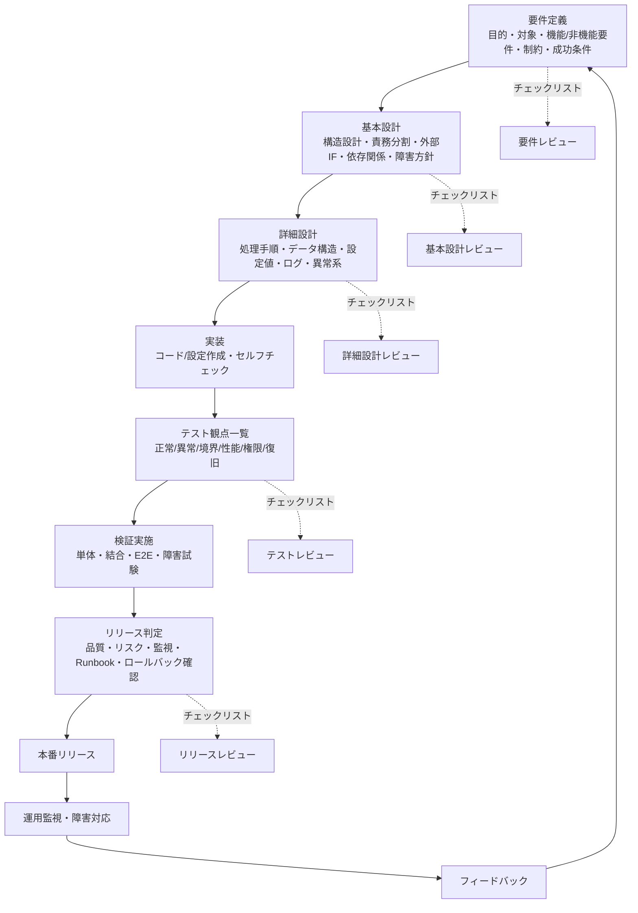

```
flowchart TD

A[要件定義<br>目的・対象・機能/非機能要件・制約・成功条件] --> B[基本設計<br>構造設計・責務分割・外部IF・依存関係・障害方針]

B --> C[詳細設計<br>処理手順・データ構造・設定値・ログ・異常系]

C --> D[実装<br>コード/設定作成・セルフチェック]

D --> E[テスト観点一覧<br>正常/異常/境界/性能/権限/復旧]

E --> F[検証実施<br>単体・結合・E2E・障害試験]

F --> G[リリース判定<br>品質・リスク・監視・Runbook・ロールバック確認]

G --> H[本番リリース]

H --> I[運用監視・障害対応]
I --> J[フィードバック]
J --> A

%% Control Points
A -.チェックリスト.-> AR[要件レビュー]
B -.チェックリスト.-> BR[基本設計レビュー]
C -.チェックリスト.-> CR[詳細設計レビュー]
E -.チェックリスト.-> ER[テストレビュー]
G -.チェックリスト.-> GR[リリースレビュー]
```