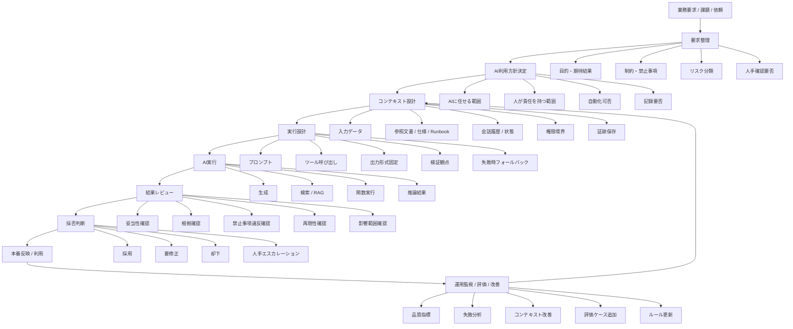

# Cheet-Note

# AIを利用した品質保証

## 1. 求めるもの全体像



---

## 2. レイヤー構造

| レイヤー | 役割 | 主な関心 |
|---|---|---|
| ① 業務レイヤー | 何を達成したいかを定義する | 目的、成果物、制約、責任分界 |
| ② ガバナンスレイヤー | AI利用の境界を決める | 任せる範囲、禁止事項、監査性、説明責任 |
| ③ コンテキストレイヤー | AIに渡す状況を設計する | 文脈、仕様、履歴、権限、参照情報 |
| ④ 実行レイヤー | AIをどう動かすかを決める | Prompt、Tool、RAG、Workflow |
| ⑤ 検証レイヤー | 結果を信じてよいか確認する | 妥当性、根拠、再現性、逸脱検知 |
| ⑥ 運用改善レイヤー | 継続的に精度と安全性を上げる | KPI、Evals、失敗分析、ルール改善 |

```
flowchart TB

    A[業務要求 / 課題 / 依頼] --> B[要求整理]
    B --> C[AI利用方針決定]
    C --> D[コンテキスト設計]
    D --> E[実行設計]
    E --> F[AI実行]
    F --> G[結果レビュー]
    G --> H[採否判断]
    H --> I[本番反映 / 利用]
    I --> J[運用監視 / 評価 / 改善]
    J --> D

    B --> B1[目的・期待結果]
    B --> B2[制約・禁止事項]
    B --> B3[リスク分類]
    B --> B4[人手確認要否]

    C --> C1[AIに任せる範囲]
    C --> C2[人が責任を持つ範囲]
    C --> C3[自動化可否]
    C --> C4[記録要否]

    D --> D1[入力データ]
    D --> D2[参照文書 / 仕様 / Runbook]
    D --> D3[会話履歴 / 状態]
    D --> D4[権限境界]
    D --> D5[証跡保存]

    E --> E1[プロンプト]
    E --> E2[ツール呼び出し]
    E --> E3[出力形式固定]
    E --> E4[検証観点]
    E --> E5[失敗時フォールバック]

    F --> F1[生成]
    F --> F2[検索 / RAG]
    F --> F3[関数実行]
    F --> F4[推論結果]

    G --> G1[妥当性確認]
    G --> G2[根拠確認]
    G --> G3[禁止事項違反確認]
    G --> G4[再現性確認]
    G --> G5[影響範囲確認]

    H --> H1[採用]
    H --> H2[要修正]
    H --> H3[却下]
    H --> H4[人手エスカレーション]

    J --> J1[品質指標]
    J --> J2[失敗分析]
    J --> J3[コンテキスト改善]
    J --> J4[評価ケース追加]
    J --> J5[ルール更新]
```

```
---

## 2. レイヤー構造

```markdown
| レイヤー | 役割 | 主な関心 |
|---|---|---|
| ① 業務レイヤー | 何を達成したいかを定義する | 目的、成果物、制約、責任分界 |
| ② ガバナンスレイヤー | AI利用の境界を決める | 任せる範囲、禁止事項、監査性、説明責任 |
| ③ コンテキストレイヤー | AIに渡す状況を設計する | 文脈、仕様、履歴、権限、参照情報 |
| ④ 実行レイヤー | AIをどう動かすかを決める | Prompt、Tool、RAG、Workflow |
| ⑤ 検証レイヤー | 結果を信じてよいか確認する | 妥当性、根拠、再現性、逸脱検知 |
| ⑥ 運用改善レイヤー | 継続的に精度と安全性を上げる | KPI、Evals、失敗分析、ルール改善 |
```