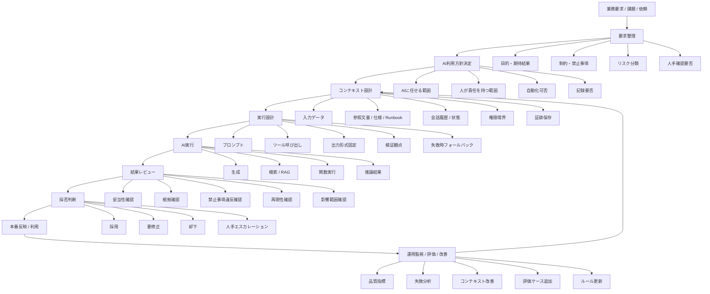

# Cheet-Note

# AIを利用した品質保証

- AI時代の品質保証とは、
  - 「良い答えを出させる技術」ではなく
  - **「要求・文脈・実行・検証・改善を一気通貫で設計し、AIを安全かつ再現可能に使う仕組み」**

## 1. 求めるもの全体像



---

## 2. レイヤー構造

| レイヤー | 役割 | 主な関心 |
|---|---|---|
| ① 業務レイヤー | 何を達成したいかを定義する | 目的、成果物、制約、責任分界 |
| ② ガバナンスレイヤー | AI利用の境界を決める | 任せる範囲、禁止事項、監査性、説明責任 |
| ③ コンテキストレイヤー | AIに渡す状況を設計する | 文脈、仕様、履歴、権限、参照情報 |
| ④ 実行レイヤー | AIをどう動かすかを決める | Prompt、Tool、RAG、Workflow |
| ⑤ 検証レイヤー | 結果を信じてよいか確認する | 妥当性、根拠、再現性、逸脱検知 |
| ⑥ 運用改善レイヤー | 継続的に精度と安全性を上げる | KPI、Evals、失敗分析、ルール改善 |

---

## 3. 品質保証の考え方

AI時代の品質保証は、
「AIが正しい答えを出すこと」だけではない。

以下の3点を同時に保証する必要がある。

1. 入力品質

- AIに渡す要求・文脈・制約が不足していないか
- 参照すべき情報が欠けていないか    
- 権限外の情報を混ぜていないか

2. 出力品質

- 結果が要求に合っているか
- 根拠が確認できるか
- 禁止事項やリスクを踏んでいないか
- フォーマット・粒度・構造が期待通りか

3. 運用品質

- 誰が使っても同程度の結果になるか
- 失敗時に戻せるか
- 評価と改善が継続できるか
- 監査証跡が残るか

---

## 4. 制御点（品質を落とさないための関門）

| 制御点 | 何を見るか | 代表的な失敗 |
|---|---|---|
| 要求整理前 | そもそもAIを使うべきか | 目的が曖昧なまま利用開始 |
| AI利用方針決定時 | AI委譲範囲は妥当か | 判断責任までAIに投げる |
| コンテキスト設計時 | 必要文脈が揃っているか | 仕様不足、履歴不足、誤参照 |
| 実行設計時 | 出力形式と検証観点があるか | 自由生成でレビュー不能 |
| 実行後レビュー時 | 結果の根拠と影響範囲は妥当か | もっともらしい誤答を採用 |
| 本番反映前 | ロールバック・承認条件があるか | そのまま反映して事故 |
| 運用時 | 失敗を学習できるか | 同じ誤りを繰り返す |

---

## 5. AI活用における代表リスク分類

| リスク分類 | 内容 | 例 | 主な対策 |
|---|---|---|---|
| 要求誤解 | AIが目的を取り違える | 要約してほしいのに提案を返す | 目的・出力形式固定 |
| 文脈欠落 | 必要情報不足で誤答 | 仕様の前提条件を見落とす | 参照資料の明示 |
| 幻覚 / 推測混入 | 根拠なく断定する | 存在しない設定値を書く | 根拠必須、引用必須 |
| 権限逸脱 | 見せてはいけない情報を扱う | 機密情報の混在 | データ境界、マスキング |
| 自動化事故 | AI出力をそのまま実行 | 誤設定を本番適用 | 人手承認、段階反映 |
| 再現性不足 | 人によって結果がぶれる | 担当者ごとに品質差が大きい | テンプレ化、評価ケース化 |
| 監査不能 | なぜその結果か追えない | 後から説明不能 | 入力・出力・根拠保存 |

---

## 6. 実務での役割分担

| 役割 | 責任 |
|---|---|
| 利用者 | 目的、制約、期待出力を明示する |
| 設計者 | コンテキスト、ワークフロー、制御点を設計する |
| レビュア | 出力妥当性、根拠、影響範囲を確認する |
| 管理者 | 利用範囲、ログ、監査、ルールを維持する |
| 改善担当 | KPI/Evals/失敗分析から継続改善する |

---

```
flowchart TB

    A[業務要求 / 課題 / 依頼] --> B[要求整理]
    B --> C[AI利用方針決定]
    C --> D[コンテキスト設計]
    D --> E[実行設計]
    E --> F[AI実行]
    F --> G[結果レビュー]
    G --> H[採否判断]
    H --> I[本番反映 / 利用]
    I --> J[運用監視 / 評価 / 改善]
    J --> D

    B --> B1[目的・期待結果]
    B --> B2[制約・禁止事項]
    B --> B3[リスク分類]
    B --> B4[人手確認要否]

    C --> C1[AIに任せる範囲]
    C --> C2[人が責任を持つ範囲]
    C --> C3[自動化可否]
    C --> C4[記録要否]

    D --> D1[入力データ]
    D --> D2[参照文書 / 仕様 / Runbook]
    D --> D3[会話履歴 / 状態]
    D --> D4[権限境界]
    D --> D5[証跡保存]

    E --> E1[プロンプト]
    E --> E2[ツール呼び出し]
    E --> E3[出力形式固定]
    E --> E4[検証観点]
    E --> E5[失敗時フォールバック]

    F --> F1[生成]
    F --> F2[検索 / RAG]
    F --> F3[関数実行]
    F --> F4[推論結果]

    G --> G1[妥当性確認]
    G --> G2[根拠確認]
    G --> G3[禁止事項違反確認]
    G --> G4[再現性確認]
    G --> G5[影響範囲確認]

    H --> H1[採用]
    H --> H2[要修正]
    H --> H3[却下]
    H --> H4[人手エスカレーション]

    J --> J1[品質指標]
    J --> J2[失敗分析]
    J --> J3[コンテキスト改善]
    J --> J4[評価ケース追加]
    J --> J5[ルール更新]
```

```
---

```
2. レイヤー構造

| レイヤー | 役割 | 主な関心 |
|---|---|---|
| ① 業務レイヤー | 何を達成したいかを定義する | 目的、成果物、制約、責任分界 |
| ② ガバナンスレイヤー | AI利用の境界を決める | 任せる範囲、禁止事項、監査性、説明責任 |
| ③ コンテキストレイヤー | AIに渡す状況を設計する | 文脈、仕様、履歴、権限、参照情報 |
| ④ 実行レイヤー | AIをどう動かすかを決める | Prompt、Tool、RAG、Workflow |
| ⑤ 検証レイヤー | 結果を信じてよいか確認する | 妥当性、根拠、再現性、逸脱検知 |
| ⑥ 運用改善レイヤー | 継続的に精度と安全性を上げる | KPI、Evals、失敗分析、ルール改善 |
```

```
4. 制御点（品質を落とさないための関門）

| 制御点 | 何を見るか | 代表的な失敗 |
|---|---|---|
| 要求整理前 | そもそもAIを使うべきか | 目的が曖昧なまま利用開始 |
| AI利用方針決定時 | AI委譲範囲は妥当か | 判断責任までAIに投げる |
| コンテキスト設計時 | 必要文脈が揃っているか | 仕様不足、履歴不足、誤参照 |
| 実行設計時 | 出力形式と検証観点があるか | 自由生成でレビュー不能 |
| 実行後レビュー時 | 結果の根拠と影響範囲は妥当か | もっともらしい誤答を採用 |
| 本番反映前 | ロールバック・承認条件があるか | そのまま反映して事故 |
| 運用時 | 失敗を学習できるか | 同じ誤りを繰り返す |
```

```
5. AI活用における代表リスク分類

| リスク分類 | 内容 | 例 | 主な対策 |
|---|---|---|---|
| 要求誤解 | AIが目的を取り違える | 要約してほしいのに提案を返す | 目的・出力形式固定 |
| 文脈欠落 | 必要情報不足で誤答 | 仕様の前提条件を見落とす | 参照資料の明示 |
| 幻覚 / 推測混入 | 根拠なく断定する | 存在しない設定値を書く | 根拠必須、引用必須 |
| 権限逸脱 | 見せてはいけない情報を扱う | 機密情報の混在 | データ境界、マスキング |
| 自動化事故 | AI出力をそのまま実行 | 誤設定を本番適用 | 人手承認、段階反映 |
| 再現性不足 | 人によって結果がぶれる | 担当者ごとに品質差が大きい | テンプレ化、評価ケース化 |
| 監査不能 | なぜその結果か追えない | 後から説明不能 | 入力・出力・根拠保存 |

```

```
## 6. 実務での役割分担

| 役割 | 責任 |
|---|---|
| 利用者 | 目的、制約、期待出力を明示する |
| 設計者 | コンテキスト、ワークフロー、制御点を設計する |
| レビュア | 出力妥当性、根拠、影響範囲を確認する |
| 管理者 | 利用範囲、ログ、監査、ルールを維持する |
| 改善担当 | KPI/Evals/失敗分析から継続改善する |
```