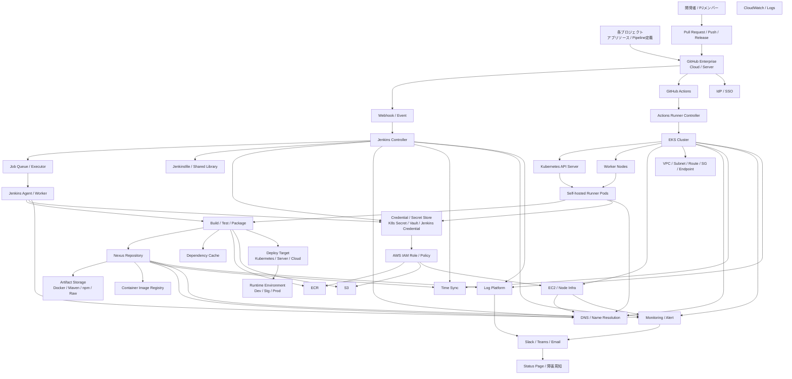
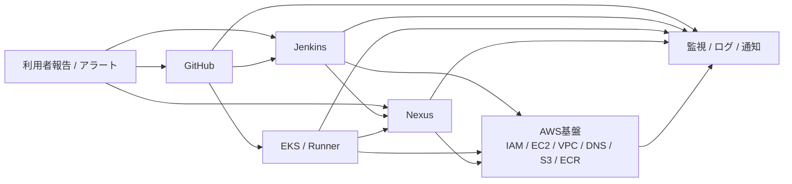

# CI基盤依存関係図

## 全体図を見やすくするためのレイヤ分解

```
1. 利用者 / イベント層
   - 開発者、PR、Push、Release

2. 制御層
   - GitHub、GitHub Actions、Jenkins Controller、ARC

3. 実行層
   - Jenkins Agent、Self-hosted Runner、EKS Pod/Node

4. 成果物層
   - Nexus、ECR、S3、Dependency Cache

5. 認証・基盤層
   - IAM、Secret、DNS、VPC、EC2、時刻同期

6. 観測・周知層
   - Monitoring、Log、Slack/Teams、Status Page
```

## 依存関係全体図

この依存関係図は、単なる図ではなく

- **「どこが上流で、どこが下流か」** を揃えるために使う
- 各ノードにRunbookの入り口を紐づけて**依存関係図 + Runbook導線図**として使う



```
mermaid
flowchart TB

  %% ===== 利用者 / 開発PJ =====
  U[開発者 / PJメンバー]
  P[各プロジェクト<br>アプリソース / Pipeline定義]

  %% ===== SCM / Trigger =====
  GH[GitHub Enterprise<br>Cloud / Server]
  GHA[GitHub Actions]
  WH[Webhook / Event]
  PR[Pull Request / Push / Release]

  %% ===== Jenkins系 =====
  JN[Jenkins Controller]
  JA[Jenkins Agent / Worker]
  JQ[Job Queue / Executor]
  JL[Jenkinsfile / Shared Library]

  %% ===== K8s / Runner =====
  EKS[EKS Cluster]
  ARC[Actions Runner Controller]
  RUNNER[Self-hosted Runner Pods]
  K8S[Kubernetes API Server]
  NODE[Worker Nodes]

  %% ===== Artifact / Repository =====
  NX[Nexus Repository]
  ARTI[Artifact Storage<br>Docker / Maven / npm / Raw]
  IMG[Container Image Registry]
  CACHE[Dependency Cache]

  %% ===== Build / Deploy先 =====
  BUILD[Build / Test / Package]
  DEPLOY[Deploy Target<br>Kubernetes / Server / Cloud]
  ENV[Runtime Environment<br>Dev / Stg / Prod]

  %% ===== 認証認可 =====
  IDP[IdP / SSO]
  IAM[AWS IAM Role / Policy]
  SEC[Credential / Secret Store<br>K8s Secret / Vault / Jenkins Credential]

  %% ===== AWS基盤 =====
  EC2[EC2 / Node Infra]
  S3[S3]
  ECR[ECR]
  CW[CloudWatch / Logs]
  VPC[VPC / Subnet / Route / SG / Endpoint]
  DNS[DNS / Name Resolution]
  NTP[Time Sync]

  %% ===== 監視 / 通知 =====
  MON[Monitoring / Alert]
  LOG[Log Platform]
  CHAT[Slack / Teams / Email]
  STATUS[Status Page / 障害周知]

  %% ===== 利用者起点 =====
  U --> PR
  P --> GH
  PR --> GH
  GH --> WH
  WH --> JN
  GH --> GHA

  %% ===== Jenkins系 =====
  JN --> JQ
  JN --> JL
  JQ --> JA
  JA --> BUILD

  %% ===== Actions / Runner系 =====
  GHA --> ARC
  ARC --> EKS
  EKS --> K8S
  K8S --> RUNNER
  EKS --> NODE
  NODE --> RUNNER
  RUNNER --> BUILD

  %% ===== Artifact参照 =====
  BUILD --> NX
  NX --> ARTI
  NX --> IMG
  BUILD --> CACHE
  BUILD --> ECR
  BUILD --> S3

  %% ===== Deploy =====
  BUILD --> DEPLOY
  DEPLOY --> ENV

  %% ===== 認証 =====
  GH --> IDP
  JN --> SEC
  JA --> SEC
  RUNNER --> SEC
  SEC --> IAM
  IAM --> ECR
  IAM --> S3
  IAM --> EC2

  %% ===== AWS / Infra依存 =====
  EKS --> EC2
  EKS --> VPC
  EC2 --> DNS
  EKS --> DNS
  NX --> DNS
  JN --> DNS
  JA --> DNS
  RUNNER --> DNS
  EKS --> NTP
  JN --> NTP
  NX --> NTP

  %% ===== 監視 / 通知 =====
  JN --> MON
  NX --> MON
  EKS --> MON
  EC2 --> MON
  MON --> CHAT
  JN --> LOG
  NX --> LOG
  EKS --> LOG
  LOG --> CHAT
  CHAT --> STATUS
```

### (縮約版)障害切り分け用の簡略依存関係図

初動では全体図が大きすぎることがあるので、
**障害切り分け専用の縮約版** もあると実務で使いやすい



```
mermaid
flowchart LR

  USER[利用者報告 / アラート]
  GH[GitHub]
  JN[Jenkins]
  EKS[EKS / Runner]
  NX[Nexus]
  AWS[AWS基盤<br>IAM / EC2 / VPC / DNS / S3 / ECR]
  OBS[監視 / ログ / 通知]

  USER --> GH
  USER --> JN
  USER --> NX

  GH --> JN
  GH --> EKS

  JN --> NX
  JN --> AWS

  EKS --> NX
  EKS --> AWS

  NX --> AWS

  GH --> OBS
  JN --> OBS
  EKS --> OBS
  NX --> OBS
  AWS --> OBS
```