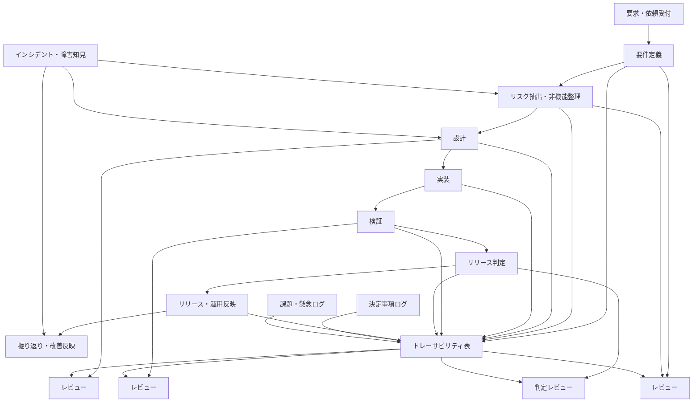

# 品質保証開発フロー（1枚構造図）

## チーム向けの説明文（短縮版）

```
このフローの目的は、作業を増やすことではなく、
要件・リスク・設計・検証・判断をつなげて、
「あとから説明する仕事」を減らすことです。

これにより、要件漏れやリスク取りこぼしを防ぎながら、
レビューする人も数分で前提を把握できるようにします。
```

## 目的

- 要件の取りこぼし防止
- リスクの先回り管理
- 判断ログの保持
- レビュー負荷の軽減

が一目で分かる構造

## フロー図



```
flowchart TD

    A[要求・依頼受付] --> B[要件定義]
    B --> C[リスク抽出・非機能整理]
    C --> D[設計]
    D --> E[実装]
    E --> F[検証]
    F --> G[リリース判定]
    G --> H[リリース・運用反映]
    H --> I[振り返り・改善反映]

    B --> T[トレーサビリティ表]
    C --> T
    D --> T
    E --> T
    F --> T
    G --> T
    H --> T

    B --> R1[レビュー]
    C --> R1
    D --> R2[レビュー]
    F --> R3[レビュー]
    G --> R4[判定レビュー]

    T --> R1
    T --> R2
    T --> R3
    T --> R4

    X1[決定事項ログ] --> T
    X2[課題・懸念ログ] --> T
    X3[インシデント・障害知見] --> C
    X3 --> D
    X3 --> I
```

## 開発は一直線に進めるが、品質保証は横串で管理する

```
要求・依頼受付
→ 要件定義
→ リスク抽出
→ 設計
→ 実装
→ 検証
→ リリース判定
→ 運用反映
→ 振り返り
```

ただし、品質は各工程ごとに個別管理すると漏れます。
そのため、下支えとして トレーサビリティ表 を置きます。

## トレーサビリティ表を中心にする

```
要件ID
リスクID
設計項目
実装対象
検証項目
判定結果
決定事項
```

これにより、

	•	この実装は何の要件に対応しているか
	•	この検証はどのリスクに対応しているか
	•	この判定は何を根拠にしたか

が追えるようになる

## レビューは「工程ごとの確認」ではなく「制御点」

つまりレビューでは次を確認します。

### 要件・リスク整理レビュー

	•	要件漏れはないか
	•	前提条件は明確か
	•	非機能・運用・保守観点が抜けていないか
	•	リスクは見えているか

### 設計レビュー

	•	要件に対して設計が対応しているか
	•	リスク対策が設計に織り込まれているか
	•	運用で回る設計か

### 検証レビュー

	•	要件・リスクに対する確認ができているか
	•	想定外ケースを見落としていないか
	•	判定根拠が残っているか

### リリース判定レビュー

	•	未解決リスクを認識した上で出すのか
	•	回避策・監視・戻し方があるか
	•	運用への引き継ぎ条件が揃っているか

## 決定事項ログ・課題ログを別建てせず接続する

> 判断決定した事項のログが流れてしまう
> 再レビュー時にまた説明が必要になる

を防ぐには、決定事項ログを議事録に閉じ込めないことです。

そのためこの図では
	•	決定事項ログ
	•	課題・懸念ログ

をトレーサビリティ表へ接続しています。

つまり、ログは残すだけでなく、
**要件・設計・検証と結びつける** ことが重要です。

## 説明するときの要点

① 今の問題

	•	要件や判断が分散する
	•	レビュー時に前提説明が必要になる
	•	決定事項が流れる
	•	要件とリスクの抜け漏れが起きる

② 原因

	•	要件、設計、リスク、検証、決定事項がつながっていない

③ 解決

	•	トレーサビリティ表を中心に、各工程を接続する

④ 効果

	•	要件漏れ防止
	•	リスク取りこぼし防止
	•	説明の二度手間削減
	•	レビュー時間短縮
	•	運用引き継ぎが楽になる
