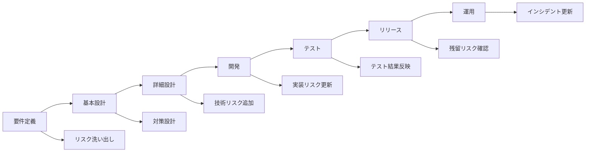

# リスク分類表

リスク分類表は **「リスクを識別 → 評価 → 対策 → 監視」までを一貫して管理する台帳（Risk Register）」**として設計する
↓
**要件定義〜設計〜運用までのトレーサビリティが維持**できる

単なるリストではなく **“分類＋影響評価＋対策＋監視” を持つ構造**にする

## 理想的な運用

次の3つを連携させると非常に強くなる

```
リスク分類表
      ↓
監視設計 (Alert)
      ↓
Runbook
```

### 例

```
Jenkins OOM
  ↓
Heap > 85%
  ↓
Runbook: JVM heap investigation
```

## 基本構造

```
リスク識別
   ↓
リスク分類
   ↓
影響度 / 発生確率 評価
   ↓
対策決定（回避 / 低減 / 受容 / 転嫁）
   ↓
監視指標設定
   ↓
定期レビュー
```

## フォーマット

| Risk ID | カテゴリ | リスク内容 | 発生原因 | 影響範囲 | 発生確率 | 影響度 | リスクレベル | 対策 | 監視方法 | オーナー | 状態 |
|--------|----------|------------|----------|----------|----------|--------|-------------|------|----------|---------|------|
| R-01 | 可用性 | Jenkins master停止 | JVM OOM | CIジョブ停止 | 中 | 高 | High | Heap増設 / GC調整 | JVMメトリクス監視 | CI基盤 | 監視中 |
| R-02 | 性能 | Nexusレスポンス低下 | ストレージIO | build遅延 | 中 | 中 | Medium | SSD化 / キャッシュ | IO wait監視 | CI基盤 | 対応中 |
| R-03 | セキュリティ | GitHub token漏洩 | Secret管理不備 | 不正アクセス | 低 | 高 | High | OIDC認証 | audit log | Platform | 監視中 |
| R-04 | 運用 | Runbook未整備 | 手順属人化 | 障害復旧遅延 | 中 | 中 | Medium | Runbook整備 | MTTR監視 | SRE | 改善中 |

```
# リスク分類表（Risk Register）

| Risk ID | カテゴリ | リスク内容 | 発生原因 | 影響範囲 | 発生確率 | 影響度 | リスクレベル | 対策 | 監視方法 | オーナー | 状態 |
|--------|----------|------------|----------|----------|----------|--------|-------------|------|----------|---------|------|
| R-01 | 可用性 | Jenkins master停止 | JVM OOM | CIジョブ停止 | 中 | 高 | High | Heap増設 / GC調整 | JVMメトリクス監視 | CI基盤 | 監視中 |
| R-02 | 性能 | Nexusレスポンス低下 | ストレージIO | build遅延 | 中 | 中 | Medium | SSD化 / キャッシュ | IO wait監視 | CI基盤 | 対応中 |
| R-03 | セキュリティ | GitHub token漏洩 | Secret管理不備 | 不正アクセス | 低 | 高 | High | OIDC認証 | audit log | Platform | 監視中 |
| R-04 | 運用 | Runbook未整備 | 手順属人化 | 障害復旧遅延 | 中 | 中 | Medium | Runbook整備 | MTTR監視 | SRE | 改善中 |
```

## カテゴリ

| カテゴリ | 内容 |
|--------|------|
| 可用性 | システム停止 / 障害 |
| 性能 | レスポンス / スループット |
| セキュリティ | 認証 / 情報漏洩 |
| 運用 | 手順 / Runbook / 監視 |
| 依存関係 | 外部サービス / インフラ |
| コスト | 予算 / リソース |
| スケジュール | 納期遅延 |
| 品質 | バグ / テスト不足 |

### CI基盤用

| カテゴリ | 具体例 |
|--------|--------|
| Build基盤 | Jenkins / GitHub Actions |
| Artifact | Nexus / Artifactory |
| Runtime | EKS / Kubernetes |
| Network | VPC / LB |
| Identity | IAM / OIDC |

## リスク評価方法（影響度 × 発生確率）

よく使われるマトリクス

```
影響度
3 = 高 (サービス停止 / 情報漏洩)
2 = 中 (性能劣化)
1 = 低 (軽微)

発生確率
3 = 高 (頻発)
2 = 中 (時々)
1 = 低 (稀)
```

Risk Score = Impact × Probability

| Score | レベル |
|--------|------|
| 7-9 | High |
| 4-6 | Medium |
| 1-3 | Low |

## リスク分類表の更新タイミング

### 要件定義

#### 目的

**リスクの洗い出し**

#### 更新内容

- 主要リスクの識別
- リスクカテゴリ分類

### 基本設計

#### 目的

**リスク対策の設計**

#### 更新内容

- 対策方針
- 監視方法
- 回避策

### 詳細設計

#### 目的

**技術リスクの具体化**

#### 更新内容

- 設定値
- アーキテクチャリスク

### 開発 / 構築

#### 目的

**実装時リスク追加**

#### 更新内容

- 新規リスク追加
- 対策更新

### テスト

#### 目的

**実証結果反映**

#### 更新内容

- 発見された問題
- リスク再評価

### リリース判定

#### 目的

**残留リスク確認**

#### 更新内容

- Accept Risk
- 残課題登録

### 運用

#### 目的

**インシデントから更新**

#### 更新内容

- 障害起因リスク追加
- 発生確率更新

## 更新タイミングを図で整理



```
mermaid
flowchart LR

A[要件定義] --> B[基本設計]
B --> C[詳細設計]
C --> D[開発]
D --> E[テスト]
E --> F[リリース]
F --> G[運用]

A --> R1[リスク洗い出し]
B --> R2[対策設計]
C --> R3[技術リスク追加]
D --> R4[実装リスク更新]
E --> R5[テスト結果反映]
F --> R6[残留リスク確認]
G --> R7[インシデント更新]
```

## 実用例

| Risk ID | カテゴリ | リスク | 原因 | 影響 | 対策 | 監視 |
|--------|----------|------|------|------|------|------|
| R-10 | 可用性 | Jenkins OOM | Build数増加 | CI停止 | Heap増設 | JVM metrics |
| R-11 | Artifact | Nexus storage full | Artifact肥大 | build失敗 | lifecycle policy | disk usage |
| R-12 | EKS | Node OOM | Pod増加 | Pod eviction | resource limit | kube metrics |
| R-13 | GitHub | Token失効 | secret rotation | pipeline失敗 | OIDC | audit log |