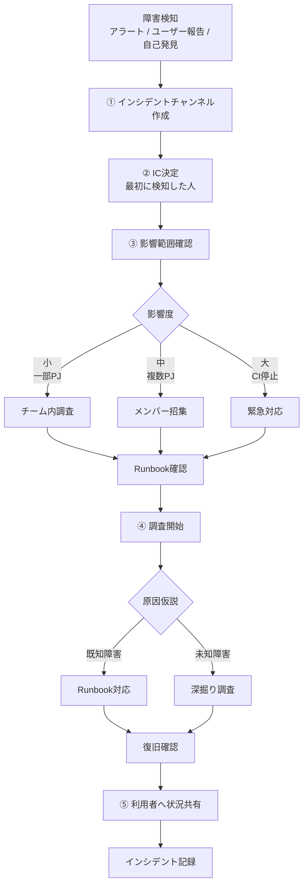

# 障害時の初動

## しなやかなチーム（障害初動が属人化しないインシデント対応能力 を持つチーム）にするには

Runbookを書けば成立する物ではない、**構造・習慣・心理安全性**の3つが揃って初めて成立する。

### 「しなやかなチーム」の本質

実は能力ではない

```
能力依存チーム
→ 誰かがいないと止まる

構造チーム
→ 誰でも同じ行動を取る
```

### 障害初動が属人化しないチームの5要素

```
        ┌──────────────────────┐
        │ 1. 初動フローが1枚で存在 │
        └─────────┬────────────┘
                  │
        ┌─────────▼────────────┐
        │ 2. 役割が明確        │
        │   (IC / Support)     │
        └─────────┬────────────┘
                  │
        ┌─────────▼────────────┐
        │ 3. Runbook導線       │
        │   (迷わない入口)     │
        └─────────┬────────────┘
                  │
        ┌─────────▼────────────┐
        │ 4. 訓練・疑似障害    │
        │   (GameDay)          │
        └─────────┬────────────┘
                  │
        ┌─────────▼────────────┐
        │ 5. 心理安全性        │
        │   (起こした人が偉い) │
        └──────────────────────┘
```

重要なのは
**「知識」ではなく「構造」**にすること

## 初動フローを一枚にする

### 前提

**障害時は考えられない**
 → **判断を排除したフロー**が必要

```
障害検知
   │
   ▼
① 障害チャンネル作成
   │
   ▼
② IC (Incident Commander) 決定
   │
   ▼
③ 影響範囲確認
   │
   ├─小 → チーム内対応
   └─中以上 → メンバー招集
   │
   ▼
④ 利用者へ第一報
   │
   ▼
⑤ 調査開始
```

ポイント

	•	3分以内に動ける
	•	判断を減らす
	•	Slack / Teams 手順付き


### インシデント初動フロー（1枚）



```
mermaid
flowchart TD

A[障害検知<br>アラート / ユーザー報告 / 自己発見]

A --> B[① インシデントチャンネル作成]

B --> C[② IC決定<br>最初に検知した人]

C --> D[③ 影響範囲確認]

D --> E{影響度}

E -->|小<br>一部PJ| F[チーム内調査]
E -->|中<br>複数PJ| G[メンバー招集]
E -->|大<br>CI停止| H[緊急対応]

F --> I[Runbook確認]
G --> I
H --> I

I --> J[④ 調査開始]

J --> K{原因仮説}

K -->|既知障害| L[Runbook対応]
K -->|未知障害| M[深掘り調査]

L --> N[復旧確認]
M --> N

N --> O[⑤ 利用者へ状況共有]

O --> P[インシデント記録]
```

## 役割を固定する（最重要）

混乱する理由の8割は
**「誰が指揮するか不明」**です。

### 役割
- 【最低限】状況判断 / 指示
- 【最低限】調査
- 周知
- ログ

```
検討事項
最初に気付いた人 = IC で迷いが減る？
```

## Runbookの「入口」を作る

### Runbookが役に立たない理由

**探せない**から

#### 構造例

```
障害
│
├─ Jenkins
│   ├─ Build失敗
│   ├─ Agent接続不可
│   └─ OOM
│
├─ Nexus
│   ├─ Artifact取得失敗
│   └─ Repository corrupt
│
└─ GitHub
    ├─ Actions runner down
    └─ API rate limit
```

#### 入口ページ

```
# CI基盤 障害入口

・ビルドが動かない
→ Jenkins Runbook

・Artifact取得できない
→ Nexus Runbook

・Runner停止
→ EKS Runner Runbook
```

## 疑似障害（GameDay）

### 注意事項

Runbookは**読んでも使えない。**

使えるようになるのは

**1回使った後**

```
おすすめ頻度
月1回
60分
```

## 心理安全性（意外と重要）

しなやかなチームの条件はこれです。

**障害を起こした人が一番早く報告する**

文化。

良いチーム

```
「ありがとう、早く言ってくれて」
```

悪いチーム

```
「なんで起きた？」
```

## 特効薬: インシデントテンプレ

```
[Incident]

発生時刻:
検知方法:
影響範囲:

状況判断 / 指示:
調査担当:

仮説:
対応:

次のアクション:
```

Slackに貼るだけ。

これだけで

	•	状況共有
	•	記録
	•	指揮

が揃う