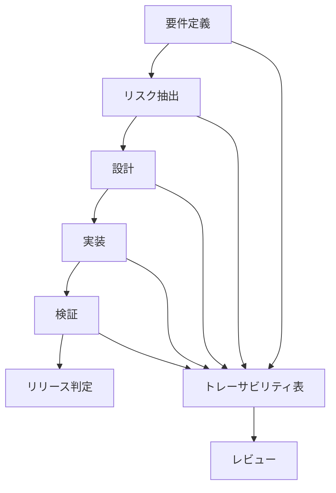
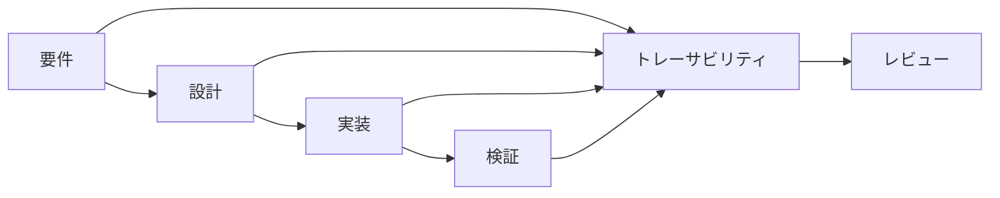

# 推奨プロセス

重要なのは**トレーサビリティ表を中心にすること**

これが

```
要件
設計
リスク
テスト
決定事項
```

をつなぐ






```
mermaid
flowchart TD

A[要件定義] --> B[リスク抽出]
B --> C[設計]
C --> D[実装]
D --> E[検証]
E --> F[リリース判定]

A --> T[トレーサビリティ表]
B --> T
C --> T
D --> T
E --> T

T --> R[レビュー]
```

```
mermaid
flowchart LR

A[要件] --> B[設計]
B --> C[実装]
C --> D[検証]

A --> T[トレーサビリティ]
B --> T
C --> T
D --> T

T --> R[レビュー]
```