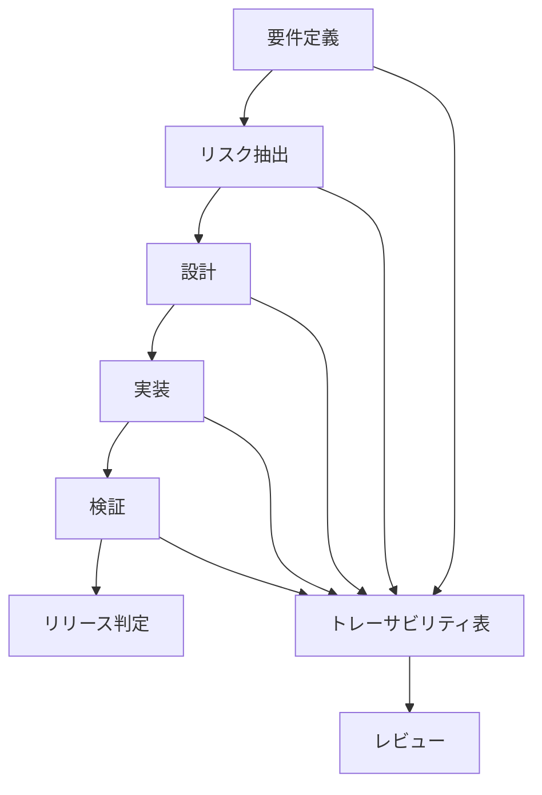

```mermaid
flowchart TD

A[要件定義] --> B[リスク抽出]
B --> C[設計]
C --> D[実装]
D --> E[検証]
E --> F[リリース判定]

A --> T[トレーサビリティ表]
B --> T
C --> T
D --> T
E --> T

T --> R[レビュー]
```

```
mermaid
flowchart TD

A[要件定義] --> B[リスク抽出]
B --> C[設計]
C --> D[実装]
D --> E[検証]
E --> F[リリース判定]

A --> T[トレーサビリティ表]
B --> T
C --> T
D --> T
E --> T

T --> R[レビュー]
```