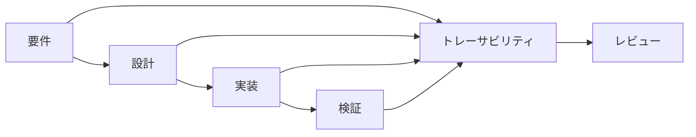

# 開発プロセス改善（要件・リスク管理の構造化）

## 1. 背景（最近起きやすい問題）

開発の中で次のようなことが起きやすいと感じています。

```
・要件の認識ズレ
・設計レビューで「なぜその判断？」と説明が必要になる
・会議 / Slack / PR に判断が分散する
・レビューする人が前提理解に時間がかかる
```

結果として

```
調査 → 説明 → 再レビュー
```

という二度手間が発生します

## 2. 原因

開発プロセスの構造的に、現在は次の情報が 分散管理 になっています。

```
要件
設計
リスク
判断理由
テスト
```

そのため

「判断の経緯」

を後から探す必要が発生します。

⸻

## 3. 解決方法

要件・設計・リスク・テストを
1つの構造で管理します。

中心になるのが トレーサビリティ表です。



```
mermaid
flowchart LR

A[要件] --> B[設計]
B --> C[実装]
C --> D[検証]

A --> T[トレーサビリティ]
B --> T
C --> T
D --> T

T --> R[レビュー]
```

トレーサビリティ表に

```
要件
設計
リスク
テスト
決定事項
```

を紐付けます。

## 4. 期待効果

この構造にすると次が改善します。

### 要件品質

```
要件漏れ防止
リスク取りこぼし防止
```

### レビュー効率

```
レビュー前提理解が数分で可能
説明の二度手間削減
```

### ナレッジ保持

```
判断理由が残る
設計意図が後から追える
```

## 5. 作業は増えるのか？

**新しい作業は増えません。**

今すでに行っている

```
要件整理
設計検討
リスク検討
レビュー
```

を **整理して記録するだけ**です。

例

```
今
Slack / 会議 / PR

↓

トレーサビリティ表
```

## 6. 運用方法

いきなり全体導入はしません。

まず

```
1つの改善タスク
または
1つの開発タスク
```

で試します。

問題があれば改善します。

## 7. 目的

この取り組みの目的は

```
開発を管理すること
ではなく

開発を楽にすること
```

です。

具体的には

```
説明の二度手間を減らす
レビューを短くする
要件漏れを防ぐ
```

ことです。=.