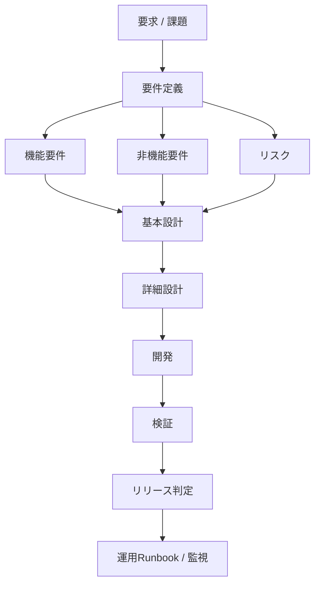
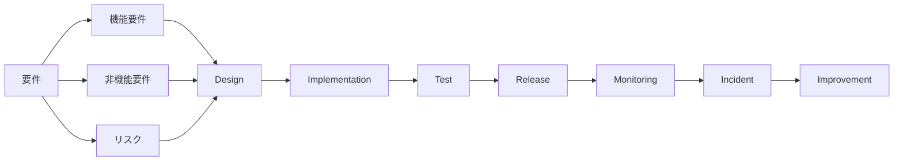

# 「機能 / 非機能 / リスク」を一気通貫で管理する仕組み

## 仕組みのポイント

- すべてをトレーサビリティでつなぐ
- 各工程で確認する観点を固定する
- 最終的にリリース判定に集約する

重要なのは**機能・非機能・リスクはすべて同時に流れる**こと


| 項目 | 途中で消えないために | ポイント |
|------|------|------|
| 機能要件 | 設計→テスト→リリース | 何をするか |
| 非機能要件 | 設計→テスト→リリース | どの品質でやるか |
| リスク | 設計→対策→検証 | 失敗する可能性 |

この3つを**同じ表で追跡する**

## 実務で安定する3点セット

① 
（全体管理）

② 
（障害防止）

③ テスト観点表
（検証）
| 成果物 | 用途 |
|------|------|
| 要件トレーサビリティ表 | 全体管理 |
| リスク分類表 | 障害防止 |
| テスト観点表 | 検証# |


## 各工程での管理観点

### 要件定義

#### 目的

**何を作るか確定する**

#### 成果物

- 要件定義書
- 要件トレーサビリティ表
- リスク一覧

#### 観点

| 観点 | 内容 |
|------|------|
| 機能要件 | 提供する機能 |
| 非機能要件 | 性能/可用性/セキュリティ |
| リスク | 失敗する可能性 |
| 依存関係 | 外部システム |

### 基本設計

#### 目的

**要件を実現する方式を決める**

#### 成果物

- 基本設計書
- アーキテクチャ図
- リスク対策=

#### 観点

| 観点 | 確認内容 |
|------|------|
| 機能要件 | 構成で実現可能か |
| 非機能要件 | 性能/可用性 設計 |
| リスク | 対策設計 |

### 詳細設計

#### 目的

**実現可能なレベルまで落とす**

#### 成果物

- 詳細設計書
- 設定値
- CI設定

#### 観点

| 観点 | 確認内容 |
|------|------|
| 機能要件 | 実装方法 |
| 非機能要件 | 設定値 |
| リスク | 検知方法 |

### 開発

#### 目的

**設計を実装する**

#### 管理

- トレーサビリティ更新

### 検証

#### 目的

**要件が満たされているか確認**

#### テスト種類

| テスト | 対象 |
|------|------|
| 機能テスト | 機能要件 |
| 性能テスト | 非機能要件 |
| 耐障害テスト | 検知方法 |

### リリース判定

#### 目的

**最終的にここに集約する**

#### 判定表

| 観点 | 確認内容 |
|------|------|
| 機能要件 | 全テストOK |
| 非機能要件 | 性能基準達成 |
| リスク | 対策済 or 許容 |

#### リリースGo/NoGo

| 観点 | 確認内容 |
|------|------|
| 機能 | OK |
| 非機能 | OK |
| リスク | 許容 |

 → リリースOK

## 全体構造（要件 → リリース判定）



```
mermaid
flowchart TD

A[要求 / 課題] --> B[要件定義]

B --> C1[機能要件]
B --> C2[非機能要件]
B --> C3[リスク]

C1 --> D[基本設計]
C2 --> D
C3 --> D

D --> E[詳細設計]

E --> F[開発]

F --> G[検証]

G --> H[リリース判定]

H --> I[運用Runbook / 監視]
```

## SRE的な理想構造



```
mermaid
flowchart LR

Requirement[要件]

Requirement --> FR[機能要件]
Requirement --> NFR[非機能要件]
Requirement --> Risk[リスク]

FR --> Design
NFR --> Design
Risk --> Design

Design --> Implementation
Implementation --> Test

Test --> Release

Release --> Monitoring
Monitoring --> Incident
Incident --> Improvement
```
