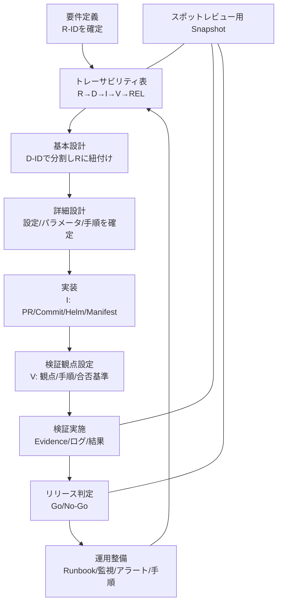

# 品質保証テンプレート一式（1枚）— 構造図＋テンプレート
> 目的：要件→設計→実装→検証→リリース判定 を **同一IDで貫通**させ、スポットレビューでも「今なにを判断すべきか」を即座に共有できる形にする

---

## 0. 構造図（全体像 / 情報の流れ）



```
flowchart TB
  A[要件定義<br/>R-IDを確定] --> B[トレーサビリティ表<br/>R→D→I→V→REL]
  B --> C[基本設計<br/>D-IDで分割しRに紐付け]
  C --> D[詳細設計<br/>設定/パラメータ/手順を確定]
  D --> E[実装<br/>I: PR/Commit/Helm/Manifest]
  E --> F[検証観点設定<br/>V: 観点/手順/合否基準]
  F --> G[検証実施<br/>Evidence/ログ/結果]
  G --> H[リリース判定<br/>Go/No-Go]
  H --> I[運用整備<br/>Runbook/監視/アラート/手順]
  I --> B

  J[スポットレビュー用 Snapshot] --- B
  J --- G
  J --- H
```