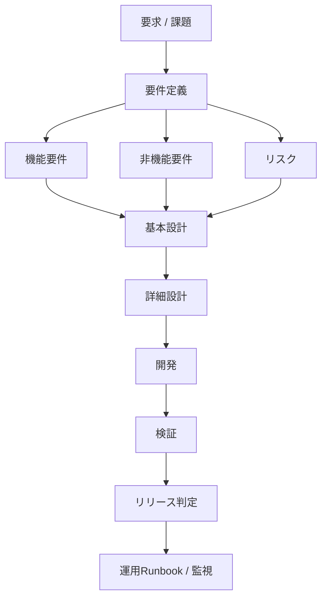
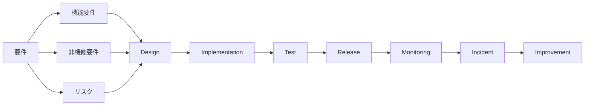

  # 品質保証テンプレート一式（1枚）— 構造図＋テンプレート
> 目的：要件→設計→実装→検証→リリース判定 を **同一IDで貫通**させ、スポットレビューでも「今なにを判断すべきか」を即座に共有できる形にする

---

## 全体構造（要件 → リリース判定）



```
mermaid
flowchart TD

A[要求 / 課題] --> B[要件定義]

B --> C1[機能要件]
B --> C2[非機能要件]
B --> C3[リスク]

C1 --> D[基本設計]
C2 --> D
C3 --> D

D --> E[詳細設計]

E --> F[開発]

F --> G[検証]

G --> H[リリース判定]

H --> I[運用Runbook / 監視]
```

## SRE的な理想構造



```
mermaid
flowchart LR

Requirement[要件]

Requirement --> FR[機能要件]
Requirement --> NFR[非機能要件]
Requirement --> Risk[リスク]

FR --> Design
NFR --> Design
Risk --> Design

Design --> Implementation
Implementation --> Test

Test --> Release

Release --> Monitoring
Monitoring --> Incident
Incident --> Improvement
```
