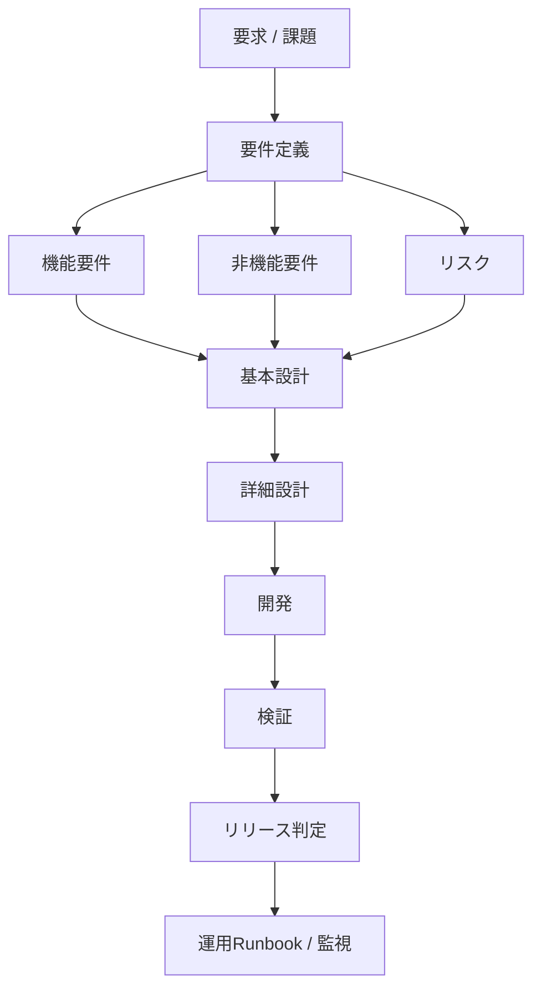
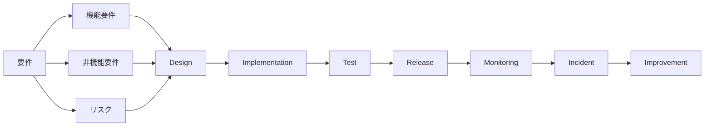

# 「機能 / 非機能 / リスク」を一気通貫で管理する仕組み

## 仕組みのポイント

- すべてをトレーサビリティでつなぐ
- 各工程で確認する観点を固定する
- 最終的にリリース判定に集約する

重要なのは**機能・非機能・リスクはすべて同時に流れる**こと


| 項目 | 途中で消えないために | ポイント |
|------|------|------|
| 機能要件 | 設計→テスト→リリース | 何をするか |
| 非機能要件 | 設計→テスト→リリース | どの品質でやるか |
| リスク | 設計→対策→検証 | 失敗する可能性 |

## 全体構造（要件 → リリース判定）



```
mermaid
flowchart TD

A[要求 / 課題] --> B[要件定義]

B --> C1[機能要件]
B --> C2[非機能要件]
B --> C3[リスク]

C1 --> D[基本設計]
C2 --> D
C3 --> D

D --> E[詳細設計]

E --> F[開発]

F --> G[検証]

G --> H[リリース判定]

H --> I[運用Runbook / 監視]
```

## SRE的な理想構造



```
mermaid
flowchart LR

Requirement[要件]

Requirement --> FR[機能要件]
Requirement --> NFR[非機能要件]
Requirement --> Risk[リスク]

FR --> Design
NFR --> Design
Risk --> Design

Design --> Implementation
Implementation --> Test

Test --> Release

Release --> Monitoring
Monitoring --> Incident
Incident --> Improvement
```
